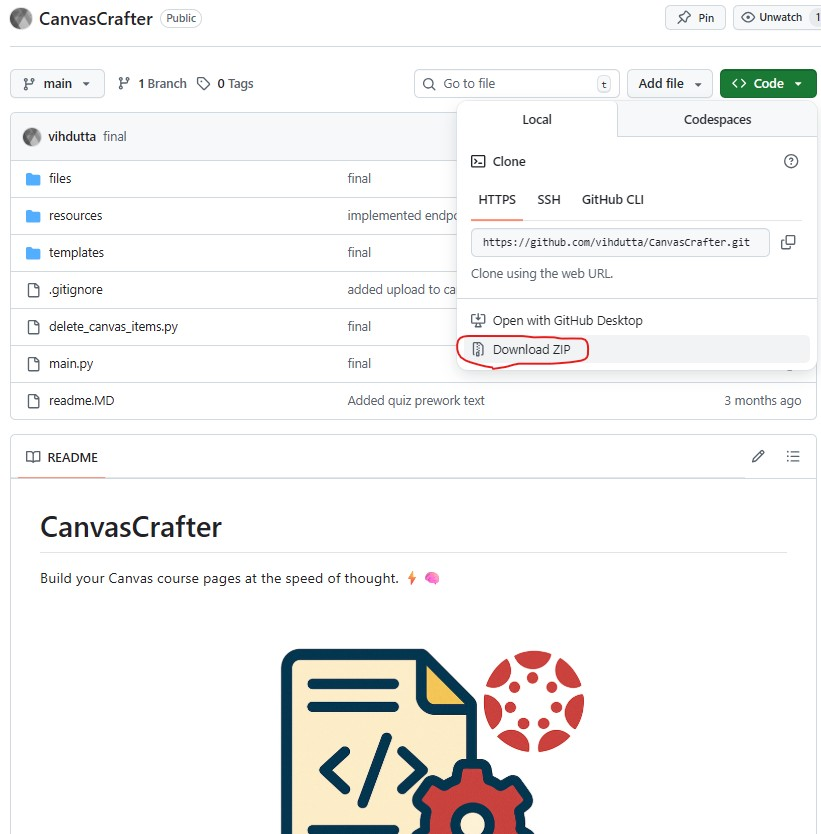
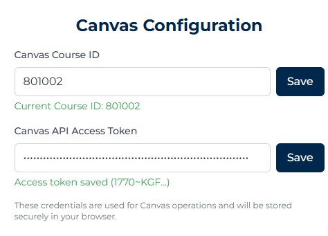
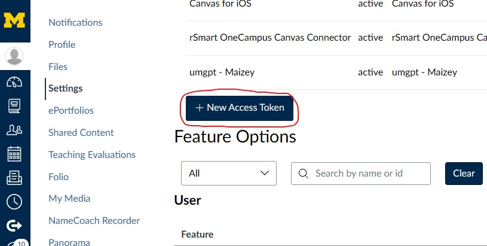
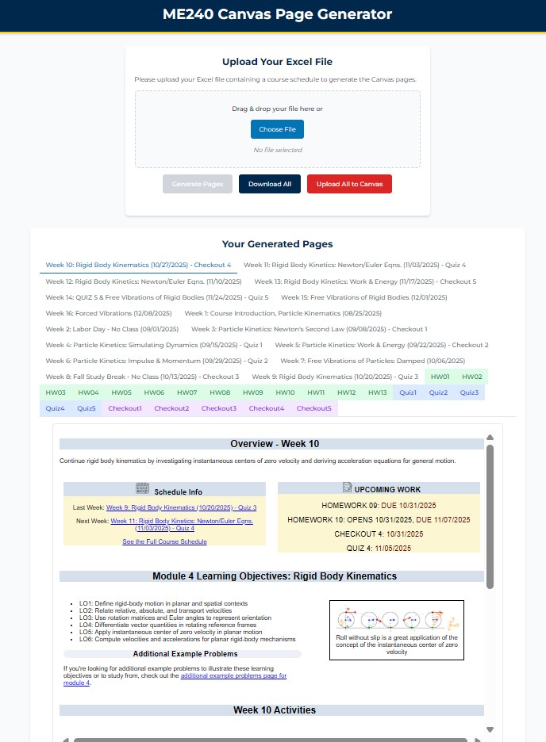

# CanvasCrafter

Build your Canvas course pages at the speed of thought. ⚡🧠

  

**Note: This project was created under the guidance of Professor Jeffrey Koller of The University of Michigan's Mechanical Engineering department to automate the creation of Canvas pages for MECHENG 240 and serve as a template for automating the creation of pages for other courses in the department.**

## ⚙️ Tech Stack
* **Frontend:** Tailwind
* **Backend:** FastAPI, Python

## Files Copied Over to Canvas
* Quiz 1 Sample - Particle Kinematics 
* Quiz 2 Sample - Particle Kinetics 
* Quiz 3 Sample - Particle Vibrations 	
* Quiz 4 Sample - Rigid Body Kinematics 
* Quiz 5 Sample - Rigid Body Kinetics 

# Installation Instructions:

In the terminal, run this command (make sure you have `git` installed. if not, follow the image below instead of running this command)
`git clone https://github.com/vihdutta/CanvasCrafter`

After downloading the files and extracting them, open a terminal window in the same directory as the folder. You will be running the following commands in them (this will require installing Python version 3.13 (other versions may work, but this is the one I used) which can be found here `https://www.python.org/downloads/`):

Run this command in that terminal window to install dependencies for the Python project.

`pip install -r requirements.txt`

After everything is installed, run this command (in the same terminal window. If you have already installed the project previously, you simply need to run this command in a terminal window in the same directory as the folder). This runs the main Python project.

`uvicorn main:app --reload --port 8080`

After this runs, go to your browser and search `http://localhost:8080/`
This will open the website interface.

Go to the bottom of the page and put in the Canvas Course ID you want to upload to (this is part of the Canvas course url, for example, for the course url `https://umich.instructure.com/courses/782767`, the course id is `782767`)

You will also have to input your Canvas API access token. Create your Canvas API access token on the account that has access to the course. Make sure to press save for the canvas course id and canvas api access token seperately. **Note that the Canvas Configuration section is stored in the browser as cookies, so you will have to input them again on another machine**

If you do not have an API access token for the above setup, navigate to `https://umich.instructure.com/profile/settings`. Click the "New Access Token" button and copy paste the access token it provides into the Canvas API Access Token box in the Canvas Configuration and press save.

For actually using the project, simply upload your excel file formatted to the example excel files in `files/yaml`. The process takes ~1 minute so take a look in the terminal after running the "Generate Pages" button to see if it is working. After it is done, you will see a preview of all the pages that were created. At that point, you are able to upload them all to Canvas with the "Upload All to Canvas" button.

# Project Structure & Functions

## File Overview

### Core Application Files
- **`main.py`** - FastAPI web server that handles file uploads, page generation, Canvas uploads, and provides the main web interface
- **`delete_canvas_items.py`** - Utility script to delete Canvas pages and assignments matching specific patterns (Week #, HW##, Quiz#, Checkout#)
- **`requirements.txt`** - Python dependencies for the project
- **`readme.MD`** - Project documentation and installation instructions

### Backend Processing Files
- **`files/backend/populate_weeks.py`** - Core data processing that reads Excel schedules and YAML files to create structured week data
- **`files/backend/populate_weeks_utils.py`** - Utility functions for week data processing, quiz/checkout detection, and homework collection
- **`files/backend/upload_to_canvas.py`** - Handles uploading generated HTML pages to Canvas as wiki pages
- **`files/backend/zip_built_htmls.py`** - Creates downloadable ZIP files containing all generated HTML files

### HTML Generation Files
- **`files/backend/build_htmls/build_weekly_page.py`** - Generates HTML for weekly course pages using Jinja2 templates
- **`files/backend/build_htmls/build_hw.py`** - Creates HTML pages for homework assignments with due dates and PDF links
- **`files/backend/build_htmls/build_quiz.py`** - Generates HTML pages for quiz assignments with learning objectives and sample links
- **`files/backend/build_htmls/build_checkout.py`** - Creates HTML pages for checkout assignments with collaboration objectives

### Utility and Helper Files
- **`files/backend/get_image_urls.py`** - Fetches image URLs from Canvas "Site Data" folder for use in generated pages
- **`files/backend/pdf_utils.py`** - Retrieves PDF file URLs from Canvas "Course Information" folder
- **`files/backend/homework_utils.py`** - Manages homework PDF links and folder navigation in Canvas
- **`files/backend/quiz_utils.py`** - Provides quiz-specific utilities like lesson ranges and date formatting
- **`files/backend/checkout_utils.py`** - Handles checkout assignment processing and learning objective management

### Configuration and Template Files
- **`files/yaml/`** - Contains YAML configuration files for course data (schedule, objectives, images, etc.)
- **`templates/`** - Jinja2 HTML templates for different page types (weekly, homework, quiz, checkout)
- **`temp/`** - Temporary storage for generated HTML files during processing
- **`uploads/`** - Temporary storage for uploaded Excel files

## Function Reference

### Main Application Functions (`main.py`)
- **`root()`** - Serves the main web interface
- **`api()`** - Provides API endpoint for week data without Canvas credentials
- **`upload_file()`** - Handles Excel file uploads and triggers HTML generation
- **`allowed_file()`** - Validates uploaded file extensions
- **`generate()`** - Returns preview of generated HTML pages for user review
- **`download_all()`** - Creates ZIP download of all generated HTML files
- **`upload_to_canvas()`** - Uploads all generated content to Canvas in proper sequence
- **`retrieve_generated_files()`** - Retrieves list of generated HTML files for processing

### Data Processing Functions (`populate_weeks.py`)
- **`populate_weeks()`** - Main function that processes Excel and YAML data into structured week objects
- **`read_overview_and_objective_yaml()`** - Loads course overview and learning objective data from YAML files
- **`load_lecture_info()`** - Reads lecture scheduling information from YAML configuration
- **`get_lecture_days_list()`** - Extracts list of lecture days from configuration

### HTML Generation Functions
- **`build_html()` (build_weekly_page.py)** - Generates HTML for all weekly course pages
- **`build_from_upload()`** - Orchestrates the entire HTML generation process from uploaded Excel file
- **`regenerate_weekly_pages_with_homework_urls()`** - Updates weekly pages with homework assignment links
- **`build_homework_html()`** - Creates HTML pages for homework assignments with PDF links
- **`build_quiz_html()`** - Generates quiz assignment pages with learning objectives
- **`build_checkout_html()`** - Creates checkout assignment pages with collaboration objectives

### Canvas Integration Functions
- **`upload_page()`** - Uploads individual HTML pages to Canvas as wiki pages
- **`upload_homework_assignment()`** - Creates homework assignments in Canvas with due dates
- **`upload_quiz_assignment()`** - Creates quiz assignments in Canvas with proper timing
- **`upload_checkout_assignment()`** - Creates checkout assignments in Canvas

### Utility Functions (`populate_weeks_utils.py`)
- **`title_to_url_safe()`** - Converts page titles to URL-safe slugs for Canvas
- **`get_week_title_with_topic_and_date()`** - Formats week titles with topics and dates
- **`find_quiz_or_checkout_in_week()`** - Detects quiz/checkout activities in week data
- **`fetch_canvas_pages()`** - Retrieves existing Canvas pages for sample quiz linking
- **`process_quiz_from_topic()`** - Extracts quiz information from topic strings
- **`process_checkout_from_topic()`** - Extracts checkout information from topic strings
- **`collect_quiz_dates()`** - Gathers all quiz dates from course schedule
- **`find_next_quiz()`** - Identifies upcoming quiz based on current week
- **`find_next_checkout()`** - Identifies upcoming checkout based on current week
- **`collect_homework_assignments_opening_during_week()`** - Finds homework assigned in specific week
- **`collect_homework_assignments_due_during_week()`** - Finds homework due in specific week

### Canvas File Management Functions
- **`fetch_image_urls_from_site_data()`** - Retrieves image URLs from Canvas file storage
- **`get_image_urls_for_yaml_data()`** - Processes image data and fetches Canvas URLs
- **`fetch_course_pdfs()`** - Gets syllabus and course information PDF links
- **`fetch_homework_pdf_links()`** - Retrieves homework and solution PDF URLs
- **`get_all_homework_pdf_links()`** - Batch retrieval of multiple homework PDF links

### Canvas Deletion Functions (`delete_canvas_items.py`)
- **`get_all_pages()`** - Retrieves all Canvas pages for deletion filtering
- **`get_all_assignments()`** - Retrieves all Canvas assignments for deletion filtering
- **`filter_pages_to_delete()`** - Identifies pages matching deletion criteria
- **`filter_assignments_to_delete()`** - Identifies assignments matching deletion criteria
- **`delete_page()`** - Deletes individual Canvas pages
- **`delete_assignment()`** - Deletes individual Canvas assignments
- **`delete_all_matching_items()`** - Orchestrates bulk deletion with user confirmation